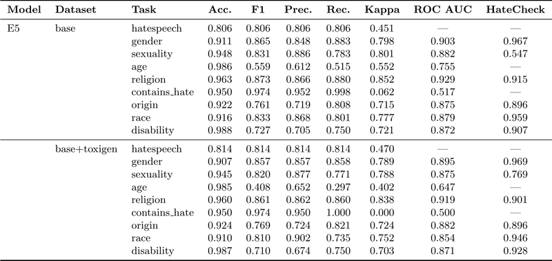
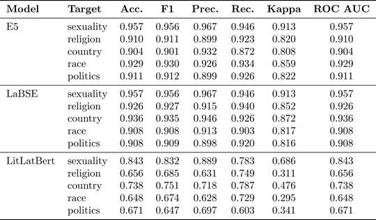

# Hate Speech Detection using Multitask Learning

This project implements multitask learning for hate speech and toxicity detection, developed as part of the HIPSTER project (in Lithuanian: _Hibridinių, informacinių, psichologinių ir visuomeninių grėsmių valdymo sistema viešosios saugos sektoriaus specialistams, verslui ir švietimui_) project at Kaunas University of Technology (KTU). It supports various transformer architectures and is specifically developed and tested on Lithuanian and English datasets.

## Key Features

- **Multitask Learning**: Jointly train models on multiple classification tasks (e.g., hate speech detection, target group identification, severity assessment).
- **Supported Architectures**: **BERT**, **Gemma 3**, **ModernBERT**
- **Efficient Fine-Tuning**: Integration with Hugging Face's `peft` for LoRA support.
- **Advanced Loss Functions**: Support for weighted cross-entropy and multiclass focal loss to handle imbalanced datasets.
- **Data Augmentation**: Scripts and notebooks for augmenting datasets using Gemma-based generation.

## Results

Detailed performance metrics and evaluation results are stored in the `perf/` directory.

### Base Models
- **E5-large (multilingual)**: A state-of-the-art text embedding model based on the XLM-RoBERTa architecture, trained with contrastive learning to provide high-quality representations for over 100 languages.
- **LaBSE (Language-Agnostic BERT Sentence Embedding)**: A model developed by Google Research specifically for multilingual sentence embeddings. It is optimized to map translations of the same sentence to similar locations in the embedding space.
- **LitLatBERT**: a trilingual model, using xlm-roberta-base architecture, trained on Lithuanian, Latvian, and English corpora. Focusing on three languages, the model performs better than multilingual BERT, while still offering an option for cross-lingual knowledge transfer

### Performance Summary

The following tables summarize the performance of various models on the Berkeley and Lithuanian datasets across multiple classification tasks:

#### Berkeley Dataset Results
Performance on the Berkeley multitask dataset using E5-large, showing robust results across different target groups. The original dataset was augmented with [Toxigen](https://huggingface.co/datasets/toxigen/toxigen-data) dataset to increase variability. The table also shows validation results using [HateCheck](https://github.com/paul-rottger/hatecheck-data) benchmark dataset 



#### Lithuanian Dataset Results
Comparison of E5-large, LaBSE, and LitLatBert on Lithuanian target group identification. Both E5 and LaBSE show superior performance in identifying specific hate speech targets compared to smaller regional models.



Complete results can be found in [this file](perf/lith_hate.csv) which contains classification performance for all the targets available in the Lithuanian Hate speech dataset. Again, E5 and LaBSE outperformed LitLatBERT model with  

## Project Structure

- `multitask_trainer.py`: Main script for training multitask models.
- `models/`: Contains multitask architecture implementations (`Bert`, `Gemma`, `ModernBert`).
- `dataset/`: Custom data loaders for various datasets (Lithuanian, Berkeley, HateCheck, AICP-FIMI).
- `augmentation/`: Data augmentation pipelines.
- `experiments/`: Jupyter notebooks with experimental results and analyses.
- `train_*.sh`: Shell scripts for common training configurations.

## Setup

   ```bash
   pip install -r requirements.txt
   ```

## Usage

### Training a Multitask Model
You can use `multitask_trainer.py` to start a training run. Example usage for E5 model:

```bash
python3 multitarget_trainer.py \
  --model-path "intfloat/multilingual-e5-large" \
  --cache-dir cache \
  --data-dir "data/lith_dataset_multi_wide" \
  --model-dir "outputs/lith_classifier_multi_wide" \
  --batch-size 64 \
  --eval-batch-size 256 \
  --num-epochs 20 \
  --tuned-layers-count 0 \
  --dropout 0.1 \
  --output-dir "test-classifier-lith" \
| tee results/lith-dataset-multitarget-nofinetune.txt
```

Refer to the `.sh` scripts in the root directory for more specialized training examples.

Note that this is an experimental code which is not tested or expected to run in production settings

## License

Copyright (C) 2025-2026 Paulius Danėnas, Kaunas University of Technology.
See `LICENSE` for more details.
